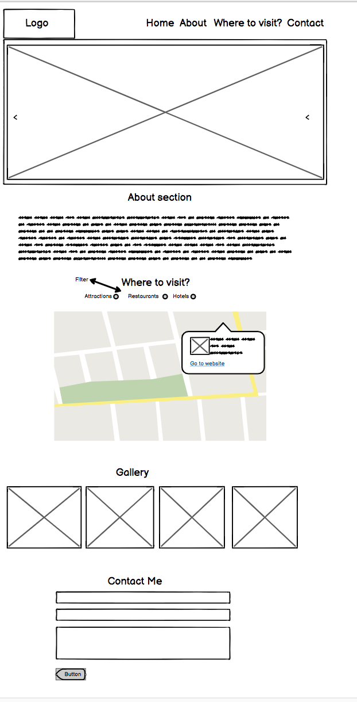
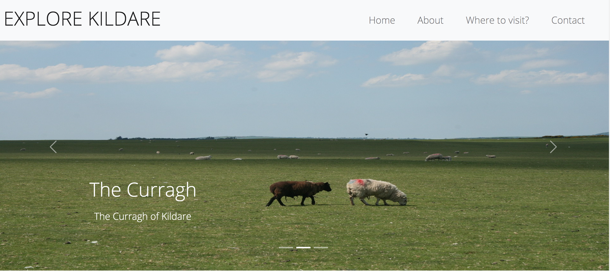
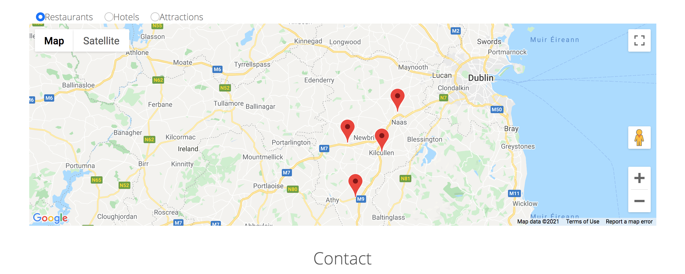
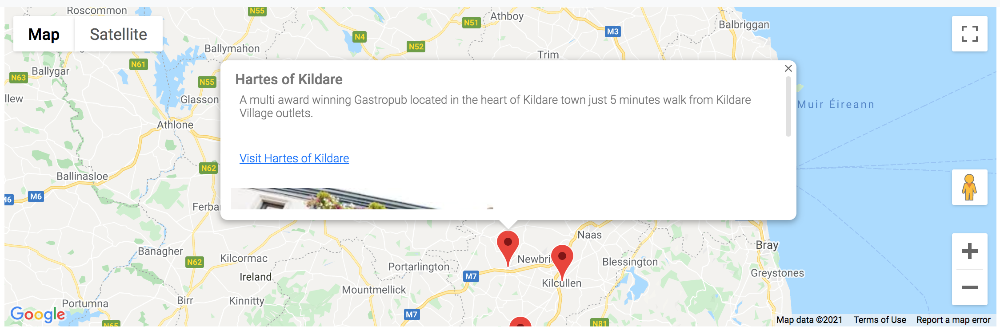
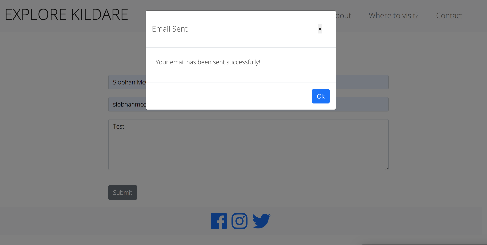
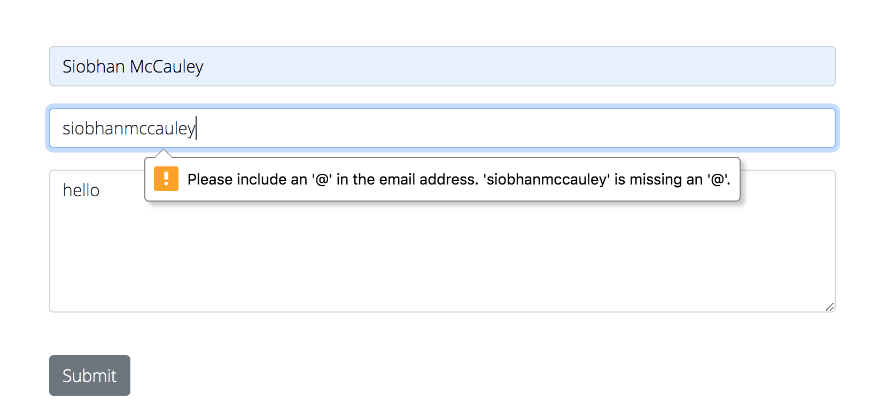

# ms-2

# Explore Kildare

This is a website designed to help users select travel choices in the county of Kildare. It is designed to be responsive on a range of devices making it accessible for users.
The live link to view it is here https://siobhanmcc.github.io/ms-2/

## Wireframes

##  User Experience (UX)  
### User Stories

1. As a user, I wish to be able to see some pictures of places I can visit in Kildare.
2. As a user, I wish to be able to look through the site and find information about places to visit broken down by restaurants, hotels and attractions.  
3. As a potential visitor, I wish to be able to look at the site and contact the owner to ask some questions about places to visit in Kildare. 

## Design  
### Colour Scheme

The main colour used in the site is light grey.

### Typography  
The main font used for the site is Open Sans.

### Imagery  
The main image for the site is an aerial shot of Kildare town. 

## Features  
Responsive on all device sizes. 

## Technologies Used  
### Languages Used  
HTML5  
CSS3
Javascript

## Frameworks, Libraries & Programs Used  
1. Bootstrap 5:  
Bootstrap was used to assist with the responsiveness and styling of the website.

2. Google Fonts:
   Google fonts were used to import the 'Open Sans' font into the style.css file which is used on all pages throughout the project.

3. Font Awesome:
Font Awesome was used on all pages throughout the website to add icons for aesthetic and UX purposes.

4. jQuery:
jQuery came with Bootstrap to make the navbar responsive. 

5. Git
Git was used for version control by utilizing the Gitpod terminal to commit to Git and Push to GitHub.
GitHub:
GitHub is used to store the projects code after being pushed from Git.

6. Google Images: Google Images was used to provide the central image for the site. 

## Testing  
The W3C Markup Validator and W3C CSS Validator Services were used to validate every page of the project to ensure there were no syntax errors in the project.

W3C Markup Validator  
W3C CSS Validator

##  Manual Testing User Stories from User Experience (UX) Section  

1. As a user looking for pictures of places to visit in Kildare, when I land on the site, the carousel feature automatically scrolls and gives a brief description of certain scenic places to visit in Kildare. 
 I also have the option to scroll down to the 'Gallery' section and click through pictures there.   

2. I am a user coming to the site to explore potential attractions to visit in Kildare. On arriving at the site, I can scroll down to get some information about the area and then click on one of three filters restaurants, hotels or attractions to see what sites there are to visit. 
When I click on restaurants, 4 markers appear. 
On click, an info window opens containing a heading, some descriptive text about the location, a link to the location and a small thumbnail image. I can click on the link to visit the location. 

3. I am a potential visitor to the area looking to ask questions about the county. On scrolling down the page, I can access a contact form where I can contact the owner with any questions I may have. When I click submit on the email form, a message appears saying email sent. 

## Further Testing
I have used development tools in Google Chrome to check how the website would look in different devices (portrait and landscape mode). In addition to that testing I have also asked friends and family to have a look at the website to let me know if everything looks ok on their browsers and devices.

After the tests I can see that the website displays properly in Chrome, Firefox, Safari and Microsoft Edge.

Problems and bugs:

In my previous submission, there was some feedback about the form accepting invalid or empty data. 
I have tested whether the email form requires proper input when being filled out. You can see here the warning message which comes up when I don't enter the email properly.
 

For the Carousel feature, on desktop it was working. On mobile however, the images were appearing but they were too small and surrounded by a lot of empty space. 
After refreshing the code, the space disappeared and the problem was fixed.  

No automated testing was added. 

## GitHub Pages  
The project was deployed to GitHub Pages using the following steps...

1. Log in to GitHub and locate the GitHub Repository
2. At the top of the Repository (not top of page), locate the "Settings" Button on the menu.
   Alternatively Click Here for a GIF demonstrating the process starting from Step 2.
3. Scroll down the Settings page until you locate the "GitHub Pages" Section.
4. Under "Source", click the dropdown called "None" and select "Master Branch".
   The page will automatically refresh.
5. Scroll back down through the page to locate the now published site link in the "GitHub Pages" section.

Run locally
To clone this project into Gitpod, follow these steps: 
1. Log into GitHub. From the list of repositories on the screen, 
select Siobhanmcc/ms-2. 
2. Above the list of files, select Code on the drop-down menu. 
3. Copy the clone URL under the HTTPS tab.
4. Start a terminal window in your preferred IDE. 
5. Change the directory to the whichever location you would like the cloned directory to be located. 
6. Type git clone, and paste the link you copied in step 3. 
7. Press enter and your local clone has now been created.

## Code
Bootstrap5: Bootstrap Library used throughout the project mainly to make site responsive by using the bootstrap navbar dropdown.
I took code from Stack Overflow to filter the markers on my Google map.

## Content
All content was written by the developer. 

## Acknowledgements
My Mentor Guido Cecillio for continuous helpful feedback.

Tutor support at Code Institute for their support.

